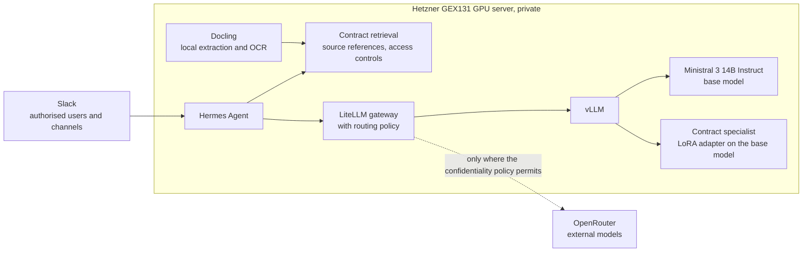

# Contract assistant

A private contract assistant on open-weight Mistral models, used through Slack. It finds and cites our signed contracts and helps with routine analysis such as NDAs and standard supplier agreements.

Everything private runs on a dedicated GPU server in Germany. A base Mistral model and a fine-tuned contract specialist share one GPU. Contract text stays on the server unless the confidentiality policy allows it to leave, and that rule is enforced in code.

> This repository holds the documentation only. It contains no contracts, datasets, model weights or credentials.

## How it works

People ask questions in Slack. Hermes Agent checks who is asking and retrieves the contract passages that person may see. It sends the request to the LiteLLM gateway, where our routing policy decides which model may receive it. Private requests go to vLLM on our own server, which serves the base model and the specialist. A request reaches an external model through OpenRouter only where the confidentiality policy permits.

## Stack

| Layer | Choice |
| --- | --- |
| Hosting | [Hetzner GEX131](https://www.hetzner.com/dedicated-rootserver/matrix-gpu/): one NVIDIA RTX PRO 6000 Blackwell Max-Q with 96 GB of VRAM and 256 GB of RAM, administered by SSH over Tailscale |
| Base model | [Ministral 3 14B Instruct 2512](https://huggingface.co/mistralai/Ministral-3-14B-Instruct-2512): Apache 2.0, 256k context, native function calling, German supported |
| Contract specialist | A LoRA adapter on the base model, trained on reviewed examples drawn from our contracts |
| Serving | vLLM, with the base model and the adapter behind one OpenAI-compatible endpoint |
| Extraction | Docling, with local OCR |
| Retrieval | A retrieval service on the server that returns source references and applies access controls |
| Agent | Hermes Agent, connected to Slack in Socket Mode |
| Gateway | LiteLLM, with a routing policy of our own |
| External models | OpenRouter, for requests whose data may leave under the confidentiality policy |
| Training | Transformers, Datasets, TRL and PEFT, on PyTorch and NVIDIA CUDA |

## Design principles

1. **Private by default.** The models, retrieval, extraction and the agent all run on our own server.
2. **No contract leaves for training.** Text is extracted on the server with Docling, including OCR. Models are downloaded from Hugging Face Hub directly onto the server, and fine-tuning runs there too.
3. **Retrieval alongside fine-tuning.** New contracts become searchable without retraining. Answers carry source references, and access controls apply to every request.
4. **One GPU, two models.** The specialist is a LoRA adapter served next to the base model, not a second full copy of it.
5. **Permissions in code.** Access rules are enforced in application code, never left to a prompt or to the model's judgement. They are checked before retrieval, and again before an answer is posted into a shared channel.
6. **External models only by policy.** Complexity alone never authorises sending a contract outside. Private requests never fall back silently to an external provider. If the private model is unavailable, the request fails and says so. Details are under [routing and privacy](docs/architecture.md#routing-and-privacy).
7. **Evidence before deployment.** An adapter goes into service only if it beats the untuned model with retrieval on unseen contracts.

## Documents

| Document | Contents |
| --- | --- |
| [Architecture](docs/architecture.md) | Components, the base model and the specialist, request flow, routing and privacy, Slack access |
| [Data and training](docs/data-and-training.md) | Contract preparation, the training sequence, rules for training data, toolchain |
| [Evaluation](docs/evaluation.md) | What is compared, on which data, the checks and the acceptance criteria |
| [Rollout](docs/rollout.md) | The five pilot phases and the exit check for each |
