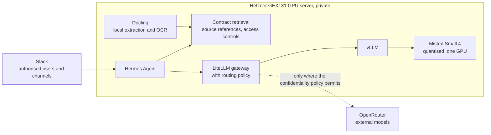

# Contract assistant

A private contract assistant built on open-weight Mistral Small 4 and used through Slack. It finds and cites our signed contracts and helps with routine analysis such as NDAs and standard supplier agreements.

Everything private runs on a dedicated GPU server in Germany. One model answers the questions: Mistral Small 4, quantised to fit the server's single GPU, working from retrieved contract passages. Contract text stays on the server unless the confidentiality policy allows it to leave, and that rule is enforced in code.

> This repository holds the documentation only. It contains no contracts, datasets, model weights or credentials.

## How it works

People ask questions in Slack. Hermes Agent checks who is asking and retrieves the contract passages that person may see. It sends the request to the LiteLLM gateway, where our routing policy decides which model may receive it. Private requests go to vLLM on our own server, which serves Mistral Small 4. A request reaches an external model through OpenRouter only where the confidentiality policy permits.

## Stack

| Layer | Choice |
| --- | --- |
| Hosting | [Hetzner GEX131](https://www.hetzner.com/dedicated-rootserver/matrix-gpu/): one NVIDIA RTX PRO 6000 Blackwell Max-Q with 96 GB of VRAM and 256 GB of RAM, administered by SSH over Tailscale |
| Model | [Mistral Small 4](https://huggingface.co/mistralai/Mistral-Small-4-119B-2603), quantised to fit the one GPU: Apache 2.0, 119B parameters with 6.5B active per token, 256k context, native function calling, German supported |
| Serving | vLLM, behind an OpenAI-compatible endpoint |
| Extraction | Docling, with local OCR |
| Retrieval | A retrieval service on the server that returns source references and applies access controls |
| Agent | Hermes Agent, connected to Slack in Socket Mode |
| Gateway | LiteLLM, with a routing policy of our own |
| External models | OpenRouter, for requests whose data may leave under the confidentiality policy |

## Model choice

The assistant first ran Ministral 3 14B Instruct with a LoRA adapter fine-tuned on reviewed examples from our contracts. We then ran Mistral Small 4, quantised to fit the same GPU, and tested it against Ministral 3 14B Instruct. Small 4 with retrieval now handles every private request, and Ministral 3 14B and its adapter are retired. Details are under [how it was chosen](docs/architecture.md#how-it-was-chosen).

## Design principles

1. **Private by default.** The model, retrieval, extraction with OCR and the agent all run on our own server. Model weights are downloaded from Hugging Face Hub directly onto it.
2. **Retrieval carries the contracts.** New contracts become searchable without retraining. Answers carry source references, and access controls apply to every request. Nothing from our contracts is trained into the model's weights, so it cannot recall a contract a user may not see.
3. **One GPU, one model.** Mistral Small 4 is a mixture-of-experts model that uses 6.5B of its 119B parameters per token. Quantised, it fits on the server's single 96 GB GPU.
4. **Permissions in code.** Access rules are enforced in application code, never left to a prompt or to the model's judgement. They are checked before retrieval, and again before an answer is posted into a shared channel.
5. **External models only by policy.** Complexity alone never authorises sending a contract outside. Private requests never fall back silently to an external provider. If the private model is unavailable, the request fails and says so. Details are under [routing and privacy](docs/architecture.md#routing-and-privacy).
6. **Evidence before deployment.** A model goes into service only after it is tested against the one it would replace. Mistral Small 4 was tested against Ministral 3 14B Instruct before it took over.

## Documents

| Document | Contents |
| --- | --- |
| [Architecture](docs/architecture.md) | Components, the model and how it was chosen, request flow, routing and privacy, Slack access |
| [Data and training](docs/data-and-training.md) | Contract preparation, why retrieval carries the contracts, and the fine-tuning behind the retired adapter |
| [Evaluation](docs/evaluation.md) | What is compared, on which data, the checks and the acceptance criteria |
| [Rollout](docs/rollout.md) | The pilot phases, the switch to Mistral Small 4, and the exit check for each |
