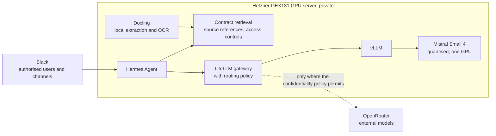
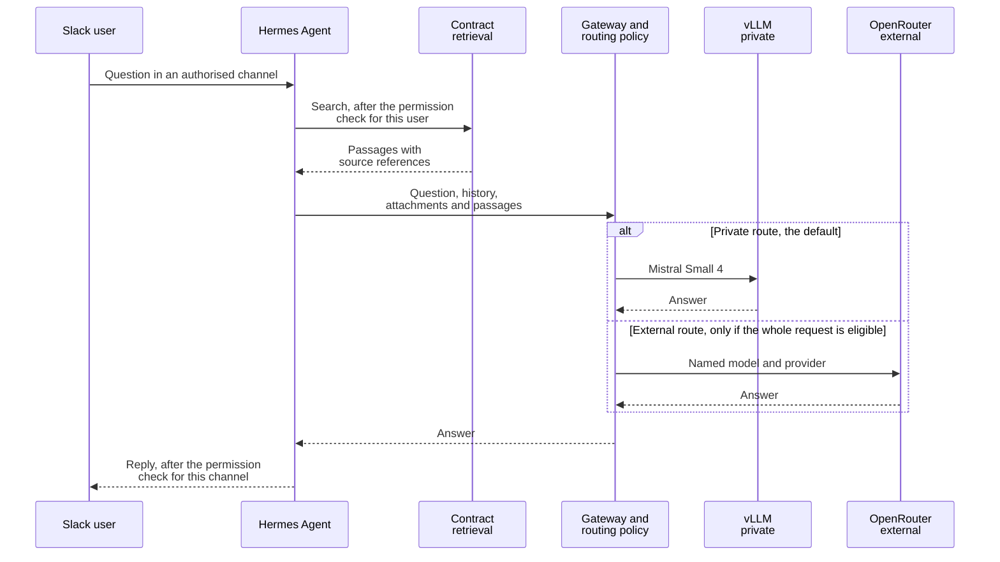

# Architecture

## Overview

A request starts in Slack. Hermes Agent checks who is asking, calls contract retrieval for the passages that person may see, and sends the request to the model gateway. The gateway applies the routing policy. It passes the request to vLLM on our own server or, where the policy permits, to an external model through OpenRouter.

## Components

| Component | Tool | Role |
| --- | --- | --- |
| Hosting | [Hetzner GEX131](https://www.hetzner.com/dedicated-rootserver/matrix-gpu/) | Runs everything private: the model, retrieval and the agent |
| Admin access | [SSH over Tailscale](https://tailscale.com/docs/features/tailscale-ssh) | Administration of the server |
| Extraction | [Docling](https://docling-project.github.io/docling/) with local OCR | Turns PDF and Word contracts into text and keeps clause references, and page references for PDFs |
| Model source | [Hugging Face Hub](https://huggingface.co/docs/hub) | Models are downloaded directly onto the server. Contracts are not uploaded |
| Serving | [vLLM](https://docs.vllm.ai/en/latest/) | Serves Mistral Small 4 behind an OpenAI-compatible endpoint |
| Retrieval | Contract retrieval service | Searches the extracted contracts, returns source references and applies access controls. Its embedding model runs on the server |
| Agent | [Hermes Agent](https://hermes-agent.nousresearch.com/docs/user-guide/messaging/slack) | Connects Slack, retrieval and the models |
| Gateway | [LiteLLM](https://docs.litellm.ai/docs/routing) | One endpoint in front of the private model and the external models |
| Routing policy | Our own code | Decides which model may receive a request |
| External models | [OpenRouter](https://openrouter.ai/docs/guides/routing/provider-selection) | Access to external models where the confidentiality policy permits |

## Model

The model in service is [Mistral Small 4](https://huggingface.co/mistralai/Mistral-Small-4-119B-2603), an open-weight Mistral model, quantised to fit the server's single GPU. It serves every private request: general tasks, agent coordination and routine contract work. Contract knowledge comes from retrieval, not from fine-tuning.

### Why this model

According to its model card on 5 October 2026:

- Apache 2.0 licence
- mixture of experts with 119B parameters, of which 6.5B are active per token
- 256k context window
- native function calling and JSON output
- a reasoning mode that can be switched on per request
- German among the supported languages

Mistral publishes the checkpoint in FP8, and the model card's vLLM example serves it across two GPUs. Quantised, it fits on the one 96 GB GPU of our server.

### How it was chosen

The assistant first ran [Ministral 3 14B Instruct](https://huggingface.co/mistralai/Ministral-3-14B-Instruct-2512), with a LoRA adapter fine-tuned on reviewed examples from our contracts. We then ran Mistral Small 4, quantised to fit the same GPU, and tested it against Ministral 3 14B Instruct. Small 4 with retrieval took over every private request, and Ministral 3 14B and its adapter were retired.

Every model in service has to pass five checks:

1. The licence terms of the exact checkpoint.
2. Tool calling end to end, from Hermes Agent through LiteLLM to vLLM ([vLLM documentation on tool calling](https://docs.vllm.ai/en/latest/features/tool_calling/)).
3. Context length. [Hermes Agent's documentation](https://hermes-agent.nousresearch.com/docs/integrations/providers) asks for at least 64k tokens, and long contracts with their retrieved passages have to fit.
4. Memory use and speed on the one GPU.
5. Quality on unseen contracts against the model it would replace.

### Server

[Hetzner GEX131](https://www.hetzner.com/dedicated-rootserver/matrix-gpu/): one NVIDIA RTX PRO 6000 Blackwell Max-Q with 96 GB of VRAM, and 256 GB of RAM. Hetzner offers it in its Nuremberg and Falkenstein data centres, both in Germany. The quantised Mistral Small 4 runs on this one card. The smaller GEX45 has a 24 GB GPU, too small for Mistral Small 4 even when quantised.

## Request flow

## Routing and privacy

### Routes

| Request | Route | Condition |
| --- | --- | --- |
| Routine contract analysis such as NDAs and supplier agreements, general tasks and agent coordination | Mistral Small 4 with retrieval, private | None |
| Selected bespoke liability or cross-border analysis | External model through OpenRouter | The whole request is eligible to leave under the confidentiality policy, and the external model tested better on that kind of task |

### Rules

1. Contract complexity alone never authorises external processing. What decides is whether the data is eligible to leave under the confidentiality policy.
2. Permissions are enforced in application code. They are not left to a prompt or to the model's judgement.
3. The whole request counts, not just the question: conversation history, attachments, retrieved passages, background summarisation, OCR, embeddings and fallbacks.
4. Private requests never fall back silently to an external provider.
5. Permissions are checked before retrieval, and again before an answer is posted into a shared Slack channel.
6. The routing policy is code. It runs before any model call, and it is covered by tests.

### Where contract content could leave the server

One control for each path.

| Path | Control |
| --- | --- |
| Conversation history | A thread that has held private material stays on the private route, whatever the next question is |
| Attachments | A file posted in Slack is classified before any external model can receive it |
| Retrieved passages | Passages carry the confidentiality of their contract into the routing decision |
| Background summarisation | Any summarising or memory step the agent runs on its own uses the private model |
| OCR | Runs on the server, with OCR engines that Docling runs locally |
| Embeddings | The embedding model runs on the server. There is no external embedding service |
| Fallbacks | No external fallback is configured for private routes, and a test proves it. If the private model is unavailable, the request fails and says so |
| Slack itself | Questions, answers and attachments pass through Slack. An answer posted in a channel contains only what every member of that channel may see |

### Controls on the external route

LiteLLM falls back to another model only where a fallback is configured ([LiteLLM routing](https://docs.litellm.ai/docs/routing)), so private routes have none. Private and external deployments never share a model name, because LiteLLM load-balances between deployments that do. OpenRouter lets a request deny data collection, require zero data retention, name the permitted providers and switch off provider fallbacks ([OpenRouter provider selection](https://openrouter.ai/docs/guides/routing/provider-selection)). External requests always name the model and the provider, with provider fallbacks switched off. The data-collection and retention settings follow the confidentiality policy.

### Slack access

Only authorised users and channels reach the assistant, and access is default deny. Hermes Agent's [Slack integration](https://hermes-agent.nousresearch.com/docs/user-guide/messaging/slack) takes an allowlist of users and a list of allowed channels, and it denies all messages when no user allowlist is set. One-to-one direct messages are exempt from the channel list, so the user allowlist is the control that counts there. The integration connects in Socket Mode, so the server needs no public inbound endpoint for Slack.

## References

Official documentation, checked on 4 and 5 October 2026.

- Hetzner: [GPU servers](https://www.hetzner.com/dedicated-rootserver/matrix-gpu/)
- Tailscale: [Tailscale SSH](https://tailscale.com/docs/features/tailscale-ssh)
- Docling: [documentation](https://docling-project.github.io/docling/)
- Hugging Face: [Hub](https://huggingface.co/docs/hub)
- Mistral: [models overview](https://docs.mistral.ai/models), [Mistral Small 4 model card](https://huggingface.co/mistralai/Mistral-Small-4-119B-2603), [Ministral 3 14B Instruct model card](https://huggingface.co/mistralai/Ministral-3-14B-Instruct-2512)
- vLLM: [documentation](https://docs.vllm.ai/en/latest/), [tool calling](https://docs.vllm.ai/en/latest/features/tool_calling/)
- Hermes Agent: [providers](https://hermes-agent.nousresearch.com/docs/integrations/providers), [Slack](https://hermes-agent.nousresearch.com/docs/user-guide/messaging/slack)
- LiteLLM: [routing](https://docs.litellm.ai/docs/routing), [vLLM provider](https://docs.litellm.ai/docs/providers/vllm), [OpenRouter provider](https://docs.litellm.ai/docs/providers/openrouter)
- OpenRouter: [provider selection](https://openrouter.ai/docs/guides/routing/provider-selection)
